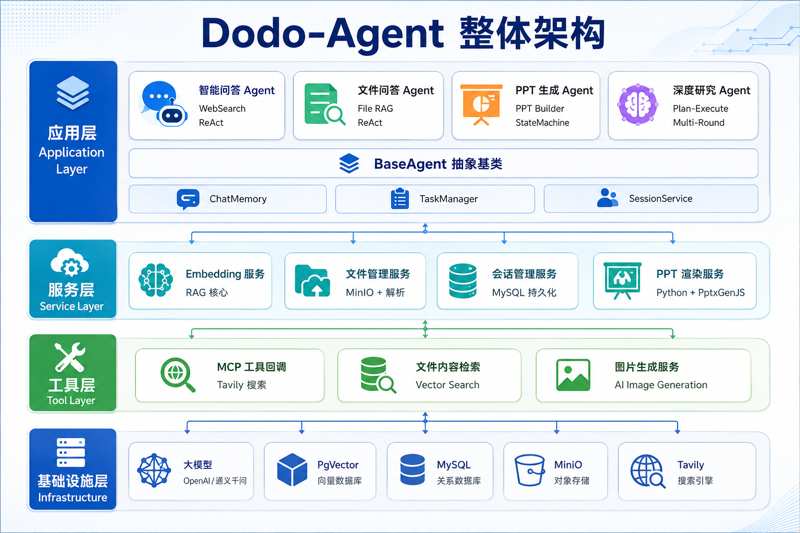
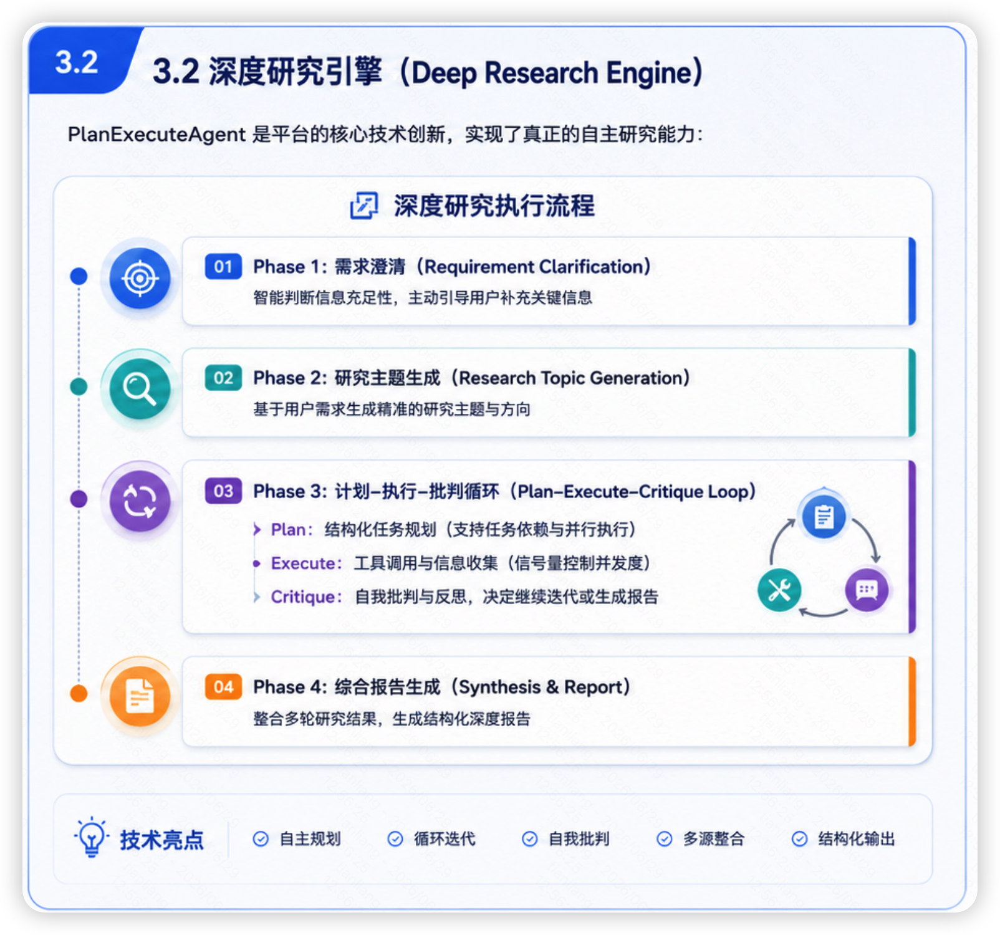
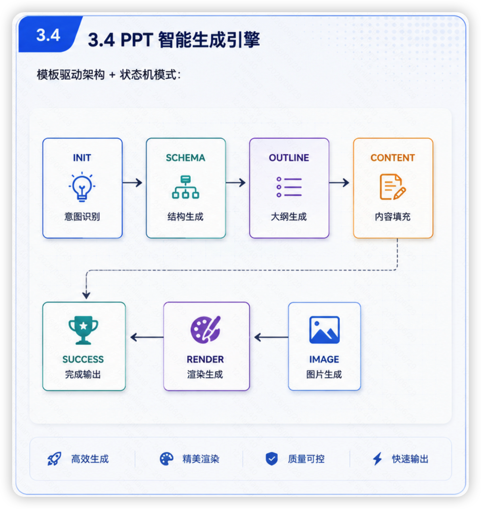

# Dodo-Agent：企业级端到端通用智能体平台

## 快速开始

本仓库已经整理为可独立运行的 Spring Boot 项目。

### 环境要求

- JDK 21
- Maven 3.9+
- MySQL 8.0
- Redis
- PostgreSQL + pgvector
- MinIO

如果本机同时安装了多个 JDK，可以先切到 JDK 21：

```bash
export JAVA_HOME=$(/usr/libexec/java_home -v 21)
export PATH="$JAVA_HOME/bin:$PATH"
```

### 本地配置

项目默认通过环境变量读取密钥和中间件连接信息，避免把个人配置提交到 GitHub。

1. 参考 `.env.example` 准备本地环境变量：

```bash
cp .env.example .env
```

2. 按你的本地环境修改 `.env`，然后在当前终端导入：

```bash
set -a
source .env
set +a
```

3. 初始化 MySQL 表结构：

```bash
mysql -u root -p dodo < src/main/resources/sql/ai_db.sql
```

4. 编译并启动：

```bash
mvn clean package
mvn spring-boot:run
```

启动后访问：

```text
http://localhost:8888
```

### 上传 GitHub

```bash
git init
git add .
git commit -m "init dodo-agent standalone project"
git branch -M main
git remote add origin git@github.com:<your-name>/dodo-agent.git
git push -u origin main
```

上传前请确认 `.env` 没有被提交，仓库中只保留 `.env.example`。

## 一、产品定位

**Dodo-Agent** 是一个面向企业级应用的端到端通用智能体（End-to-End Universal Agent）平台，采用多智能体架构，基于 Spring AI 生态构建，深度融合大语言模型（LLM）能力与现代软件工程架构，提供从感知、推理到执行的全链路智能化解决方案。

---

## 二、整体架构




---

## 三、核心技术创新

### 3.1 多模式智能体架构（Multi-Mode Agent Architecture）

| Agent 类型 | 核心模式 | 技术特点 | 适用场景 |
|-----------|---------|---------|---------|
| **WebSearchReactAgent** | ReAct | 实时联网搜索 + 推理执行 | 实时信息查询、新闻分析 |
| **FileReactAgent** | RAG + ReAct | 文档向量化 + 语义检索 | 企业内部文档问答 |
| **PPTBuilderAgent** | State Machine | 意图识别 + 状态驱动 + 断点续传 | 智能演示文稿生成 |
| **PlanExecuteAgent** | Plan-Execute | 需求澄清 → 计划生成 → 多轮执行 → 批判反思 | 深度研究、复杂任务分解 |

### 3.2 深度研究引擎（Deep Research Engine）

**PlanExecuteAgent** 是平台的核心技术创新，实现了真正的自主研究能力：




**技术亮点：**
- **智能并发控制**：基于 `Semaphore` 实现工具调用并发度控制（默认3个并发）
- **断点续传机制**：支持任意阶段中断后恢复执行
- **自我批判机制**：每轮执行后自动评估信息充分性，驱动多轮迭代
- **上下文压缩**：自动检测上下文长度，超长时触发智能压缩

### 3.3 高级 RAG 检索增强

```java
// 查询处理流水线
Query originalQuery = Query.builder().text(question).build();

// Step 1: 查询压缩重写 (CompressionQueryTransformer)
Query compressed = queryTransformer.transform(originalQuery);

// Step 2: 查询扩展 (MultiQueryExpander) 
List<Query> expandedQueries = queryExpander.expand(compressed);
// 生成3个扩展查询 + 保留原始查询

// Step 3: 语义检索 + 元数据过滤
Filter.Expression filter = builder.eq("fileid", fileId).build();
List<Document> results = vectorStore.similaritySearch(
    SearchRequest.builder()
        .query(eq.text())
        .topK(5)
        .filterExpression(filter)
        .build()
);
```


### 3.4 PPT 智能生成引擎

**模板驱动架构 + 状态机模式**：




**核心能力：**
- **意图识别**：自动区分 CREATE / MODIFY / RESUME 三种操作意图
- **断点重连**：任意状态中断后可从当前状态恢复
- **AI 配图**：集成图片生成服务，自动为幻灯片生成配图
- **多格式渲染**：支持 Python-pptx 和 PptxGenJS 双引擎渲染

### 3.5 统一流式响应协议

平台采用统一的 SSE 流式响应协议，支持四种消息类型：

```
{"type": "thinking", "content": "正在分析问题..."}
{"type": "text", "content": "这是最终回答内容"}
{"type": "reference", "content": "[{\"title\": \"来源1\", \"url\": \"...\"}]", "count": 3}
{"type": "recommend", "content": "[\"相关问题1\", \"相关问题2\"]"}
```

---

## 四、技术栈

### 4.1 核心技术框架

| 层级 | 技术选型 | 版本 |
|-----|---------|------|
| **基础框架** | Spring Boot + Spring AI | Spring Boot 3.5.6 / Spring AI 1.1.0 |
| **响应式编程** | Project Reactor | 3.6.x |
| **大模型接入** | OpenAI API / 通义千问 | Compatible Mode |
| **向量嵌入** | Spring AI Embedding | - |
| **工具协议** | Model Context Protocol (MCP) | 1.0 |

### 4.2 数据存储

| 类型 | 技术 | 用途 |
|-----|------|------|
| **关系数据库** | MySQL 8.0 | 会话历史、元数据管理 |
| **向量数据库** | PostgreSQL + pgvector | 语义向量存储与检索 |
| **对象存储** | MinIO | 文件存储、PPT文件托管 |

### 4.3 AI/ML 组件

| 组件 | 功能 |
|-----|------|
| **CompressionQueryTransformer** | 查询压缩与重写 |
| **MultiQueryExpander** | 查询扩展增强召回 |
| **BeanOutputConverter** | 结构化输出解析 |
| **ChatMemory** | 对话历史管理 |

### 4.4 外部服务集成

| 服务 | 用途 |
|-----|------|
| **Tavily MCP** | 高质量网页搜索 |
| **通义千问/GLM** | 大语言模型推理 |
| **文本嵌入模型** | 语义向量化 |

---

## 五、企业级特性

### 5.1 高可用设计
- **任务并发控制**：基于会话 ID 的任务去重与并发限制
- **优雅中断**：支持用户随时停止生成，资源自动释放
- **持久化记忆**：对话历史自动持久化到 MySQL，支持跨会话恢复

### 5.2 可观测性
- **全链路日志**：详细记录思考过程、工具调用、执行耗时
- **性能指标**：首字响应时间、总响应时间、工具调用统计
- **引用溯源**：所有外部信息自动记录来源，支持结果验证

### 5.3 扩展性
- **插件化工具**：基于 MCP 协议，工具可热插拔
- **多模型支持**：通过配置切换不同 LLM 提供商
- **自定义 Agent**：继承 BaseAgent 快速开发新类型智能体

---

## 六、应用场景

| 场景 | Agent 组合 | 价值 |
|-----|-----------|------|
| **企业知识库问答** | FileReactAgent | 基于内部文档的智能问答，数据安全可控 |
| **市场情报分析** | PlanExecuteAgent + WebSearchReactAgent | 自动化竞品分析、行业研究 |
| **智能办公助手** | PPTBuilderAgent | 一句话生成专业演示文稿 |
| **多轮深度调研** | PlanExecuteAgent | 复杂问题的多维度深度研究 |

---

## 七、总结

Dodo-Agent 代表了企业级智能体平台的发展方向：

1. **架构先进**：采用分层架构设计，职责清晰，易于扩展
2. **技术前沿**：深度融合 Spring AI、MCP、RAG 等最新技术
3. **能力全面**：覆盖感知、推理、执行、反思的完整智能闭环
4. **工程成熟**：具备企业级的高可用、可观测、可扩展特性

Dodo-Agent 不仅是一个工具平台，更是企业智能化转型的**核心基础设施**，为构建下一代 AI 原生应用提供坚实底座。
